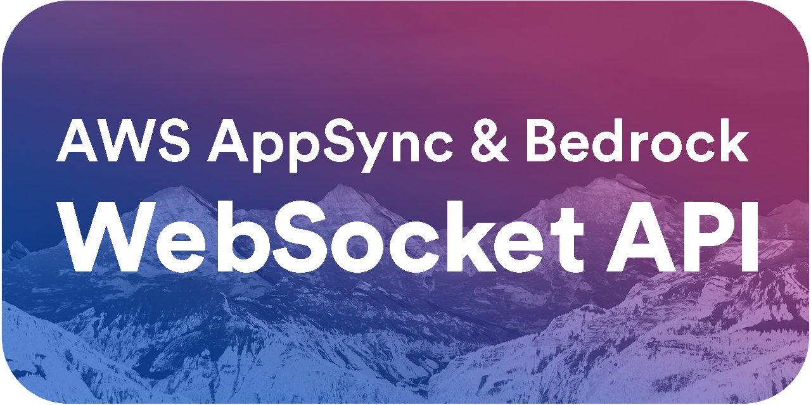

# Table of Content <!-- omit in toc -->
- [Overview](#overview)
  - [Demo](#demo)
  - [Architecture](#architecture)
  - [Terminology](#terminology)
  - [Tools Used](#tools-used)
  - [Infrastructure Services Used](#infrastructure-services-used)
  - [The Event Flow](#the-event-flow)
- [Zero to Hero](#zero-to-hero)
  - [Pre-requisites](#pre-requisites)
  - [Bedrock Setup](#bedrock-setup)
  - [Pinecone Setup (Optional)](#pinecone-setup-optional)
  - [ElevenLabs API Access Setup (Optional)](#elevenlabs-api-access-setup-optional)
  - [Infrastructure Deployment - Custom Domain (Optional)](#infrastructure-deployment---custom-domain-optional)
  - [API Deployment](#api-deployment)
  - [Frontend Deployment](#frontend-deployment)
    - [Infrastructure](#infrastructure)
    - [React App](#react-app)
- [License](#license)


# Overview
This repository contains the AWS CDK Infrastructure-as-code for an AWS AppSync web socket API to provide real-time functionality backed by AWS Bedrock. It is designed with serverless in mind and uses a variety of AWS services to provide a scalable Gen AI API.

A simple [Vite](https://vitejs.dev/) and [TypeScript](https://www.typescriptlang.org/) based frontend is provided to demonstrate the functionality of the API.

## Demo
The following demo demonstrates the project in action with an example persona who is an expert in viticulture and has been provided with documents on French wineries so that specific wineries can be referenced by name when asked questions.

https://github.com/Kyle-L/Bedrock-AppSync-API/assets/36929178/7ccbf55d-6391-4915-b9ed-9663df5eb22d

## Architecture


## Terminology
- **Model**: A model is a Gen AI model that is used to process user messages.
- **Persona:** A persona is the identity of the chatbot and contains all information that is specific to a given chatbot, but most notably the system prompt and model that they use for processing user messages.
- **Thread**: A thread is a conversation between a user and the chatbot.
- **Message**: A message is a single message in a thread.

## Tools Used
Frontend and Backend Infrastructure Build Tools:
- **AWS CDK**: AWS Cloud Development Kit (CDK) is an open-source software development framework to define cloud infrastructure in code and provision it through AWS CloudFormation.
- **TypeScript**: TypeScript is a language that builds on JavaScript by adding static type definitions.
- **Node.js**: Node.js is an open-source, cross-platform, back-end JavaScript runtime environment that runs on the V8 engine and executes JavaScript code outside a web browser.
- AWS Tools and Services:
  - **AWS AppSync**: AWS AppSync is a managed serverless GraphQL service that simplifies application development by letting you create a flexible API to securely access, manipulate, and combine data from one or more data sources.
  - **AWS Bedrock**: AWS Bedrock is a service that provides access to Gen AI models like Anthropics Claude 2 or Jurassic-1.
  - **AWS DynamoDB**: Amazon DynamoDB is a key-value and document database that delivers single-digit millisecond performance at any scale.
  - **AWS Lambda**: AWS Lambda is a serverless computing service that lets you run code without provisioning or managing servers.
  - **AWS Cognito**: Amazon Cognito lets you add user sign-up, sign-in, and access control to your web and mobile apps quickly and easily.
  - **AWS S3**: Amazon Simple Storage Service (Amazon S3) is an object storage service that offers industry-leading scalability, data availability, security, and performance.
  - **AWS CloudFront**: Amazon CloudFront is a fast content delivery network (CDN) service that securely delivers data, videos, applications, and APIs to customers globally with low latency, and high transfer speeds, all within a developer-friendly environment.
  - **AWS SQS**: Amazon Simple Queue Service (SQS) is a fully managed message queuing service that enables you to decouple and scale microservices, distributed systems, and serverless applications.
- Third-Party Tools and Services:
  - **Pinecone**: Pinecone is a vector database that allows you to store and query high-dimensional vectors.
  - **ElevenLabs API**: ElevenLabs is a company that provides a variety of AI services, including speech-to-text and text-to-speech. Their API is used in this project to provide the text-to-speech functionality for the chatbot.

Frontend App Build Tools:
- **Vite**: Vite is a build tool that aims to provide a faster and leaner development experience for modern web projects.
- **React**: React is a JavaScript library for building user interfaces.
- **TypeScript**: TypeScript is a language that builds on JavaScript by adding static type definitions.
- **Tailwind CSS**: Tailwind CSS is a utility-first CSS framework packed with classes like flex, pt-4, text-center, and rotate-90 that can be composed to build any design, directly in your markup.
- **AWS Amplify Library**: The AWS Amplify library is a collection 

## Infrastructure Services Used

**Frontend**:
| Service                   | Description                                                                                                      |
|---------------------------|------------------------------------------------------------------------------------------------------------------|
| [CloudFront](https://aws.amazon.com/cloudfront/)  | Acts as a CDN for the static files of the front end and serves them from the S3 bucket.                           |
| [S3](https://aws.amazon.com/s3/)                   | Stores the static files of the front end.                                                                         |

**Backend**:

| Service                   | Description                                                                                                      |
|---------------------------|------------------------------------------------------------------------------------------------------------------|
| [AppSync](https://aws.amazon.com/appsync/)         | Provides a GraphQL API to the frontend, using both `mutations` and `queries`, as well as `subscriptions` for real-time chat messages. |
| [Bedrock](https://aws.amazon.com/bedrock/)         | AWS Bedrock is used to provide the AI capabilities of the chatbot.                                                |
| [DynamoDB](https://aws.amazon.com/dynamodb/)       | Used to store the threads, messages, and the status of the Gen AI processing.                                     |
| [SQS](https://aws.amazon.com/sqs/)                 | Acts as a queue for the messages that are sent to the Bedrock invocation lambda.                                  |
| [Lambda](https://aws.amazon.com/lambda/)           | Handles the invocation of AWS Bedrock and pre-processes the message before sending it to SQS.                     |
| [Cognito](https://aws.amazon.com/cognito/)         | Handles the authentication of the users and authorizes them to use the AppSync API.                                |

## The Event Flow

1. A user sends a message to the AppSync API.
2. If provided a threadId, an AppSync resolver will retrieve the thread from DynamoDB.
3. The Queue trigger lambda will be invoked with the conversation history, the user's new prompt, and the threadId.
4. The Queue trigger lambda will check the status of the thread in DynamoDB to see if it is currently being processed and only continue if it is not.
5. The Queue trigger lambda will send the message to SQS after additional validation checks and update the status of the thread in DynamoDB to `PROCESSING`.
6. The Bedrock invocation lambda will be invoked by SQS and will send the message to AWS Bedrock for processing.
7. As the Bedrock invocation lambda receives chunks, it will store the completed result and send back the chunks to the user via an AppSync subscription.
8. Once, the Bedrock invocation lambda has received all the chunks, it will update the status of the thread in DynamoDB to `PROCESSED`, store the result, and send the status update to the user via an AppSync subscription to indicate that the last chunk has been sent.
9. The user will receive the result of the Gen AI processing via an AppSync subscription.
10. The user can then send another message to the AppSync API.
11. The process repeats.

# Zero to Hero
> This section guides you through the process of deploying the infrastructure.

## Pre-requisites
> This section guides you through the process of setting up the infrastructure.
> The project is written in TypeScript and uses (AWS CDK)[https://aws.amazon.com/cdk/] to deploy the infrastructure. Before we dive into deploying the front end and backend, we will need to get the prerequisites out of the way.

Before you start, it is highly encouraged to review the [AWS CDK Getting Started Guide](https://docs.aws.amazon.com/cdk/latest/guide/getting_started.html) to get a better understanding of the AWS CDK and how it works.

1. Pre-requisites:
  - [Node.js](https://nodejs.org/en/) version 20 or later.
  - [AWS CLI](https://aws.amazon.com/cli/) version 2 or later.
  - [AWS CDK](https://docs.aws.amazon.com/cdk/latest/guide/getting_started.html) version 2 or later.
  - [Pinecone](https://www.pinecone.io/) account *(optional)*.
  - [ElevenLabs](https://www.elevenlabs.io/) account *(optional)*.

2. Configure your AWS CLI. If you have not already done so, you can configure your AWS CLI by running the following command and following the prompts. For more information, see [Configuring the AWS CLI](https://docs.aws.amazon.com/cli/latest/userguide/cli-configure-quickstart.html).
```bash
aws configure
```

3. Clone the repository and navigate to the infrastructure directory.
```bash
git@github.com:Kyle-L/Bedrock-AppSync-API.git 
cd Bedrock-AppSync-API/infrastructure
```

4. Install the dependencies.
```bash
npm install
```

5. Install AWS CDK
```bash
npm install -g aws-cdk
```

6. Bootstrap the AWS CDK environment.
```bash
cdk bootstrap
```

7. (Optional) If you would like to speed up some of the steps, a `setup.sh` script is provided to help you set up the infrastructure. This will install all node depedencies and copy the `.env.example` to `.env` for you. You will still need to update the `.env` file with your appropriate values.
```bash
./setup.sh
```

8. Congrats! You are now ready to deploy the infrastructure. See (Backend)[#backend] and (Frontend)[#frontend] for more information on deploying the frontend and the backend of the project.

## Bedrock Setup
> If you are not familiar with AWS Bedrock, AWS Bedrock is an API that grants access to GenAI models like Anthropics Claude 2 or Jurassic-1. It is used in this project to provide the GenAI capabilities of the chatbot.
> While it is an AWS service that is largely set up by the infrastructure, you will need to have access to the service to use it.

1. Go to the AWS Bedrock console at [https://console.aws.amazon.com/bedrock/](https://console.aws.amazon.com/bedrock/).

2. Go to "Model Access" and request access to the model that you would like to use.
   - The default models used in this project are `Anthropics Claude 1 Instant`, `Anthropics Claude 2.1`, and `Anthropics Claude 3 Sonnet`.
   - If you would like to use a different model, you can request access to it by clicking on "Request Access" and update the model tuning file to include the new model here: [infrastructure/src/lib/utils/ai/model-tuning.ts)](./infrastructure/src/lib/utils/ai/model-tuning.ts).

3. Wait and check your email for the approval of your request. Should take only a few minutes, but I have had a few take several hours. Once approved, you are ready to deploy the infrastructure.

## Pinecone Setup (Optional)
> If you are not familiar with Pinecone, Pinecone is a vector database that allows you to store and query high-dimensional vectors. It is used in this project to store the embeddings of the messages and to query for similar messages.
> For this project, we are using it as the vector database that backs a [Bedrock Knowledge Base](https://docs.aws.amazon.com/bedrock/latest/userguide/knowledge-base.html) to allow our chatbot to provide relevant responses to the user based on data from an S3 bucket.

1. Create a Pinecone account at [https://www.pinecone.io/](https://www.pinecone.io/).

2. Create a new Pinecone index.
  - There are additional configurations that you must provide when creating a Pinecone index:
    - Name – The name of the vector index. Choose any valid name of your choice. Later, when you create your knowledge base, enter the name you choose in the Vector index name field.
    - Dimensions – The number of dimensions in the vector. Choose `1536`. This is what the Knowledge Base uses.
    - Distance metric – The metric used to measure the similarity between vectors. While the Knowledge Base supports multiple distance metrics, choose `cosine` for this example. You can experiment with other distance metrics later.

3. Get the Pinecone API key and the Pinecone index name.
  - You can find the API key and the index name in the Pinecone console.

4. Create a new AWS Secrets Manager secret for PineCone. Save the ARN of the secret for later.
```sh 
aws secretsmanager create-secret --name <MY_SECRET_NAME> --secret-string '{"apiKey":"<MY_API_KEY>"}'
```

## ElevenLabs API Access Setup (Optional)
> If you are not familiar with ElevenLabs, ElevenLabs is a company that provides a variety of AI services, including speech-to-text and text-to-speech. It is used in this project to provide the text-to-speech functionality for the chatbot.

1. Create an ElevenLabs account at [https://www.elevenlabs.io/](https://www.elevenlabs.io/).

2. Get the ElevenLabs API key.
  - You can find the API key in the ElevenLabs in the upper right corner click on your profile picture -> profile.
  - Documentation for the ElevenLabs API Query can be found [here](https://elevenlabs.io/docs/api-reference/text-to-speech#authentication).

3. Create a new AWS Secrets Manager secret for ElevenLabs. Save the ARN of the secret for later.
```sh 
aws secretsmanager create-secret --name <MY_SECRET_NAME> --secret-string '{"apiKey":"<MY_API_KEY>"}'
```

## Infrastructure Deployment - Custom Domain (Optional)
> This section guides you through the process of deploying a custom domain for related frontend and backend infrastructure.

*Note: We are doing this outside of CDK as DNS validation is required and if you are managing your domain outside of AWS, it can be a hassle as CloudFormation will wait for DNS validation to complete before deploying the stack, which can take a while depending on your DNS provider and the TTL of your DNS records.*

1. Choose a custom domain for the backend and the front end. For example, `api.example.com` for the backend and `app.example.com` for the frontend.
  - It is important that the custom domain for the backend and the frontend are entirely or subdomains of the same domain.

2. Create an ACM certificate for the custom domain(s). Once you have the custom domain(s) chosen, you will need to create an ACM certificate for the custom domain(s).
  - You can create an ACM certificate by navigating to the ACM console clicking on `Request a certificate` and following the prompts. 
    - If one or both of the custom domains are subdomains of the same domain, you can create a single certificate with multiple domain names, but you will need to specify both domain names when creating the certificate or create a wildcard certificate.
      - *Example: If I chose `api.example.com` and `app.example.com` as my custom domains, I can create a single certificate with both domain names with `example.com` and `*.example.com` as a subject alternative name (SAN).*
    - If the frontend and backend are entirely different domains, you will need to create two separate certificates.
      - *Example: If I chose `api.example.com` and `app.example.io` as my custom domains, I will need to create two separate certificates, one for `api.example.com` and one for `app.example.io`.*

3. Update your DNS records to validate the ACM certificate. Once you have created the ACM certificate, you will need to update your DNS records to validate the certificate.
  - You can validate the certificate by navigating to the ACM console and clicking on the certificate that you created. You will then need to click on `Create record in Route 53` or `Create record in DNS` and follow the prompts.
  - If you are using a DNS provider outside of AWS, you will need to create the DNS records manually. You can find the DNS records that you need to create by clicking on the certificate and navigating to the `Domain` section of the certificate.

4. Complete (API Deployment)[#api-deployment] and (Frontend Deployment)[#frontend-deployment] before continuing.

5. Create a new DNS record for the AppSync API.
  - Once you have deployed the backend, you will need to create a new DNS record for the AppSync API.
  - You can find the DNS record that you need to create by navigating to the AppSync console and clicking on the API that you created. You will then need to click on the `Settings` tab and copy the value of the `API URL` field.
  - You will then need to create a new DNS record for the AppSync API. The type of the DNS record will be `CNAME` and the value will be the `API URL` of the AppSync API.

6. Create a new DNS record for the CloudFront distribution.
  - Once you have deployed the front end, you will need to create a new DNS record for the CloudFront distribution.
  - You can find the DNS record that you need to create by navigating to the CloudFront console and clicking on the distribution that you created. You will then need to click on the `Domain Name` and copy the value of the `Domain Name` field.
  - You will then need to create a new DNS record for the CloudFront distribution. The type of the DNS record will be `CNAME` and the value will be the `Domain Name` of the CloudFront distribution.

## API Deployment
> This section guides you through the process of deploying the backend infrastructure.
> This includes our AppSync API, DynamoDB tables, Lambda functions, and more.

1. Check into the `infrastructure` directory.
```bash
cd Bedrock-AppSync-API/infrastructure
```

2. Install the dependencies.
```bash
npm install
```

3. Copy `.env.example` to `.env` and update the values with your appropriate values. The following are the variables that you will need to update:

| Variable | Description | Optional/Required |
| --- | --- | --- |
| `FRONTEND_ACM_CERTIFICATE_ARN` | The Amazon Resource Name (ARN) of the AWS Certificate Manager (ACM) certificate for the backend's custom domain. | Optional |
| `FRONTEND_DOMAIN` | The custom domain name for the backend. | Optional |
| `BACKEND_API_ACM_CERTIFICATE_ARN` | The Amazon Resource Name (ARN) of the AWS Certificate Manager (ACM) certificate for the backend's custom domain. | Optional |
| `BACKEND_API_DOMAIN` | The custom domain name for the backend. | Optional |
| `config.backend.pinecone.connectionString` | The connection string for the Pinecone service. | Optional |
| `PINECONE_CONNECTION_STRING` | The connection string for the Pinecone service. | Optional |
| `PINECONE_SECRET_ARN` | The Amazon Resource Name (ARN) of the AWS Secrets Manager secret for PineCone. | Optional |
| `SPEECH_SECRET_ARN` | The Amazon Resource Name (ARN) of the AWS Secrets Manager secret for ElevenLabs. | Optional |

- *Note: While you can deploy everything at once, it is highly encouraged to update `customDomain`, `pinecone`, and `speechSecretArn` after the initial deployment of the backend infrastructure. This is to minimize deployment time should issues arise with the deployment.*

1. Deploy the backend infrastructure.
```bash
cdk deploy GenAI/Backend
```

1. Congrats! You have now deployed the backend infrastructure. See (Frontend)[#frontend] for more information on deploying the frontend.

## Frontend Deployment
> This section guides you through deploying the front-end infrastructure and the corresponding Vite app.
> This includes our S3 bucket and CloudFront distribution.

### Infrastructure 

1. Check into the `infrastructure` directory.
```bash
cd Bedrock-AppSync-API/infrastructure
```

2. Install the dependencies.
```bash
npm install
```

3. Copy `.env.example` to `.env` and update the values with your appropriate values. The following are the variables that you will need to update:

| Variable | Description | Optional/Required |
| --- | --- | --- |
| `VITE_COGNITO_USER_POOL_ID` | The user pool ID of the Cognito user pool. | Required |
| `VITE_COGNITO_USER_POOL_CLIENT_ID` | The user pool client ID of the Cognito user pool. | Required |
| `VITE_API_URL` | The URL of the AppSync API. | Required |

4. Deploy the frontend infrastructure.
```bash
cdk deploy GenAI/Frontend
```

1. Congrats! You have now deployed the frontend infrastructure. You can now access the frontend by navigating to the CloudFront distribution URL.

### React App

1. Check into the `frontend` directory
```
cd Bedrock-AppSync-API/frontend
```

2. Install the dependencies.
```bash
npm install
```

3. Build the Vite App
```
npm run build
```

5. Deploy the Vite App to S3
```
aws s3 sync dist/ s3://<YOUR_BUCKET_NAME>/ --delete
```

# License
[](./LICENSE)
